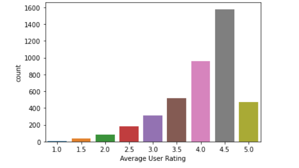
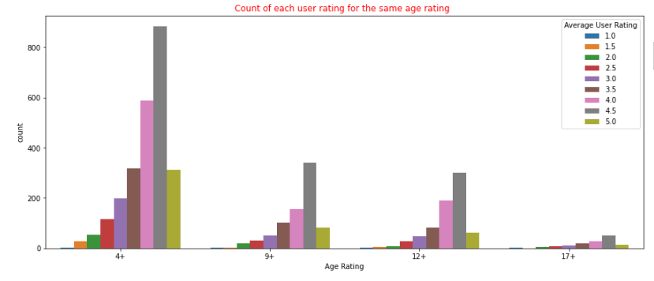
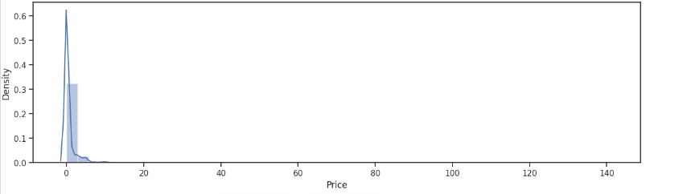
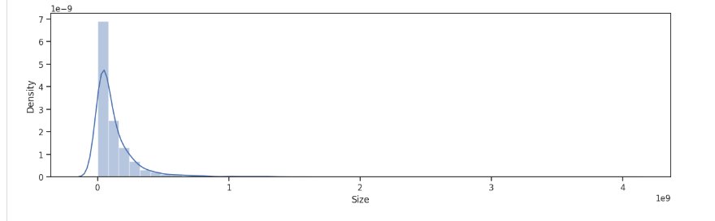
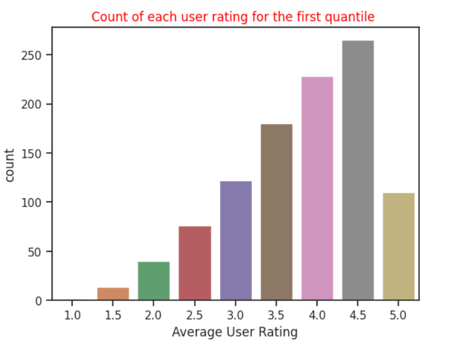
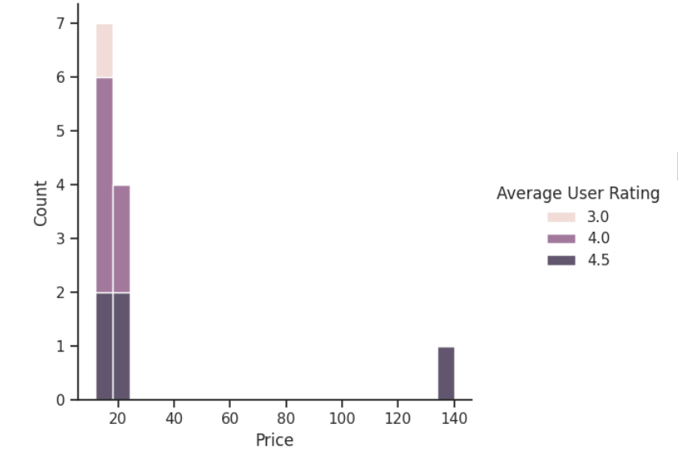
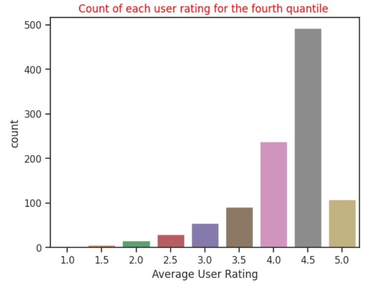
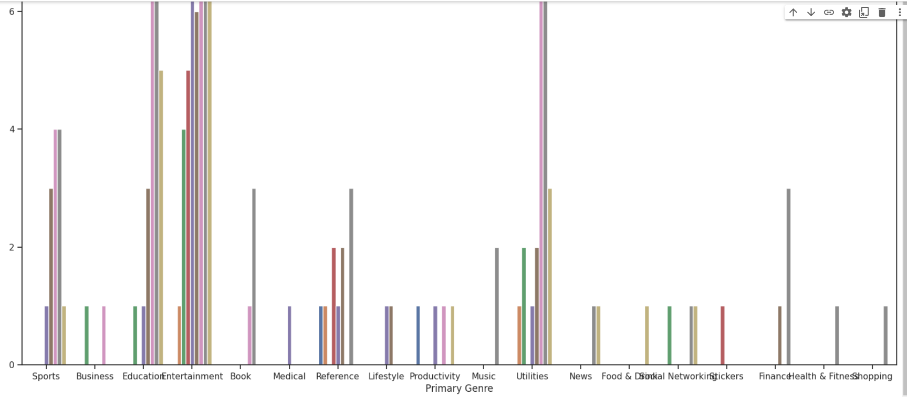
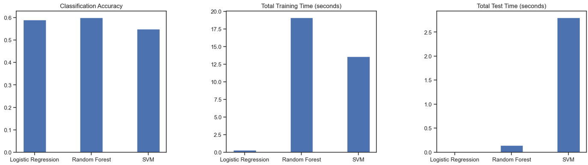

# Game Application Success Predicion
---
# Regression

## Preprocessing Techniques


### Managing Missing Values

- Count the nulls found in each column of the data frame. After calculating it was found out that:

  - __Subtitle__ contains nulls with more than $70\%$ percent.
  - __In-app purchase__ contains nulls with about $39\%$ percent.
  - __Language__ contains nulls with about $0.2\%$.

    ```python
        data.isnull().sum().sort_values(ascending=False)
    ```

- Handling missing values:

  - __Subtitle__ and __In-app purchase__ were dropped as columns, As filling the missing values with imaginary values would affect the accuracy of the model.

    ```python
    data.drop(['Subtitle','In-app Purchases'],axis=1,inplace=True)
    ```

  - The nulls in __Language__ would be filled with the mode value of this column as it was found out during analysis that the data was skewed.

    ```python
    data['Languages'].fillna(data['Languages'].mode()[0], inplace= True)
    ```
<br> <br> <br> <br> <br> <br> <br> <br> <br> <br> <br> <br> <br> <br>

## Managing Unique Values

- __Checking__ if the columns containing unique values 

  ```python
  data['ColumnName'].is_unique
    ```

- __Dropping__ unique columns as they won’t affect the decision taken to predict values of average rating 

  ```python
  data.drop(['URL','Icon URL','Name','ID'],axis=1,inplace=True)
  ```


## Handling Date

- Converting date columns __Original Release Date__, __Current Version Release Date__ from dtype object to int64 by making type first as datetime64 

  ```python
  data['Original Release Date']=pd.to_datetime(data['Original Release Date'],dayfirst=True).astype('datetime64[ns]').astype('int64')

  data['Current Version Release Date'] = pd.to_datetime(data['Current Version Release Date'],dayfirst=True).astype('datetime64[ns]').astype('int64')
  ```


## Managing Categorical Columns

- Using __ANOVA__ technique to test correlation between the categorical columns are __Primary Genre__, __Genres__, __Developer__, __Languages__ and numerical column __Average User Rating__. 

  ```python
  import statsmodels.api as sm
  from statsmodels.formula.api import ols

  model = ols('Rating ~ Developer', data=data).fit()
  sm.stats.anova_lm(model, typ=2)

  model = ols('Rating ~ Primary', data=data).fit()
  sm.stats.anova_lm(model, typ=2)

  model = ols('Rating ~ Languages', data=data).fit()
  sm.stats.anova_lm(model, typ=2)

  model = ols('Rating ~ Genres', data=data).fit()
  sm.stats.anova_lm(model, typ=2)
  ```
<br>

  + __Language__: The result of __ANNOVA__ was greater than 0.5 so the column was dropped.

    ```python
    data.drop(['Languages'],axis=1,inplace=True)
    ```
  
  + __Primary Genre__, __Genres__ & __Developer__: The result of __ANNOVA__ was less than 0.5 so __One Hot Encoding Technique__ was used and dropping those columns to be replaced by their values.

    ```python
    dumies1=pd.get_dummies(data['Developer'])
    dumies2=pd.get_dummies(data['Primary Genre'])

    dumies3=data['Genres'].str.get_dummies(sep=",")

    data=data.drop(['Developer'],axis=1)
    data=data.drop(['Primary Genre'],axis=1)
    data=data.drop(['Genres'],axis=1)

    data=pd.concat([data,dumies1],axis='columns')
    data=pd.concat([data,dumies2],axis='columns')
    data=pd.concat([data,dumies3],axis='columns')
    ```

  + __Age Rating__ a categorical column with numeric values so the ‘+’ was removed by replacing it with empty string then converting it into numeric values.

    ```python
    data['Age Rating']=data['Age Rating'].str.replace('+', '')
    data['Age Rating']=data['Age Rating'].apply(pd.to_numeric)
    ```


## Anomaly Detection 

- Using the __Isolation Forest Algorithm__ to detect anomalies by predicting if the sample is an anomaly or not, Then dropping the anomaly ones.

  ```python
  from sklearn.ensemble import IsolationForest
  model_IF = IsolationForest(contamination=float(0.1))
  model_IF.fit(train_data)

  data_without_outliers=train_data.loc[train_data['anomaly']!=-1]
  X_train=data_without_outliers.drop(['Average User Rating','anomaly'],axis=1)
  ```
<br> <br> <br> <br>

## Normalizing 

- By using __StandardScaler__ function that removes the __mean__ and __scales__ each feature/variable to unit variance.

- It works by subtracting the mean from each feature and then dividing by the standard deviation. This results in all the features having zero mean and unit variance.

  ```python
  from sklearn.preprocessing import StandardScaler
  sc = StandardScaler()
  X_train_std = sc.fit_transform(X_train)
  X_test_std = sc.transform(X_test)
  ```


## Analysis

- By getting the count plot for the target column Average user rating it was found out that data skewed to the left and the maximum Average user rating found is 4.5

  

<br> <br> <br> <br> <br> <br> <br> <br> <br> <br> <br>


- Analysis was made on the four categories in Age rating column with the target column Average user rating was found that the distribution of the data was the same in all different category 


  


<br>
<br>
<br>
<br>
<br>
<br>
<br>
<br>

- By getting the density for the two columns Size and Price  it was found that most of the values are __zeroes__ 


  

  


- By getting four different quantiles for size column it was found out that the distribution of the data was the same in all of them , left skewed with maximum Average user rating value 4.5  


  

<br>
<br>
<br>
<br>
<br>
<br>

-  We checked how would the Average user rating be affected if the value of the price column increases, it was found out that directly proportional as the price increases the Average user rating tends to increase but as the number of entries with the price more than ten is low (12 entry)  so this rows does not affect the target column


  


  


- Analysis was made on Primary genre values (except game).Many values was detected to be an outlier.


  


## Regression Techniques


### XGB

- A series of weak learners (usually decision trees) are trained sequentially to iteratively improve the accuracy of the final model. Each weak learner is trained on the residual errors from the previous tree, so that the next tree can focus on the errors that the previous trees were unable to capture.

### Lasso Regression

- A linear regression technique that helps to prevent overfitting by adding a penalty term to the cost function. The penalty term is proportional to the absolute values of the coefficients of the regression model, which encourages some of the coefficients to be exactly zero. This can be useful for selecting important features and reducing the complexity of the model.


### Linear Regression

- Linear regression is a statistical method used to model the relationship between a dependent variable (y) and one or more independent variables (x). The goal of linear regression is to find the "best fit" line that describes the linear relationship between the variables.


### Decision Tree

- A decision tree works by recursively splitting the data into subsets based on the values of the input variables until a decision can be made about the value of the target variable.

- At each node of the decision tree, the algorithm evaluates a condition based on one of the input variables and splits the data into two or more subsets based on the outcome of the condition. This process is repeated for each subset, creating a branching structure as the tree grows.


### Random Forest

- A random forest consists of a large number of decision trees, each of which is constructed using a random subset of the original data and a random subset of the input features. The trees are built independently and their predictions are combined to make the final prediction.

- At each node of the tree, the algorithm selects the best feature to split the data based on criteria such as information gain or Gini impurity. However, in random forest, the selection of the feature is limited to a random subset of the original features. This creates diversity among the trees and reduces overfitting, as each tree has its own biases and errors.


### SVR

- The algorithm works by finding the best hyperplane that fits the data, while minimizing the distance between the predicted values and the true values.

- In SVR, the hyperplane is represented by a function that takes the input features as input and outputs the predicted value. The function is constructed using a subset of the training data, called support vectors, that are closest to the hyperplane.


## Difference between models

### Linear regression and SVR

- Handling non-linear relationship:

  + linear regression assumes a linear relationship between the input features and output variable can’t handle non-linearity while SVR can handle non-linearity using kernel functions.


- Goal:

  + linear regression aim to minimize the sum of MSE while SVR aim to find hyperplane with maximum margin.


- Overfitting:

  + linear regression suffers from overfitting when the number of feature is large while SVR can handle high dimensional dataset with good generalization due to regularization techniques.


  ### Linear regression and XGBoost

  - Handling non-linear relationship: 

    + linear regression assumes a linear relationship between the input features and output variable can’t handle non-linearity while XGB can handle non-linearity using decision trees.


  _ Ways of learning:

    + linear regression is a single model learn with fixed coefficients while XGB is an ensemble learning combine multiple decision trees.

  - Regularization:

    + Must apply regularization technique on linear regression while XGB includes built in regularization techniques.

  - Feature Importance:

    + XGB provides feature importance score that rank importance of each input feature while linear regression not.


## RESULTS

### Errors

  - Linear regression: 0.5159922923602814

  - XGB: 0.4364058167245837

  - SVR: 0.4676278131452984

### Features

  - Used:

   + Developer, Primary Genre, Genres, Original Release Date, Current Version Release Date. 

  - Discarded:

    + URL, ID, Name, Subtitle, Icon URL,  User Rating Count, Price, In-app Purchases, Description, Age Rating Languages, Size.

  - Size:

    + The data was split into 80% training and 20% testing where the number of entries used in training was 3731 entry while testing was 1043 entry.


### Improvement

- Grid Search technique was used for improvement as it creates grid of all possible combinations of the model hyperparameters values then train the model with each combination.

- Techniques with built in regularization (Lasso, XGB, SVR) were used instead of linear regression that doesn’t apply regularization.

### Conclusion

- The best models that were concluded are XGB and SVR as they deal with non-Linearity. And the dataset used was found to be non-Linear.

- It was intuited that the linear regression model wasn’t said to be the best as the linear regression doesn’t handle nonlinear features and it was proved as the error of the model was the greatest of all models.

- It was intuited that features as URL, ID, Name, Icon URL are unique features and was proved by checking them using the ```is_unique``` function.


- It was intuited that Price and Size features would affect the predicted target feature but it was disproved during analysis.


---
---
# Classification

## Feature Selection

- Categorical features:

  + For categorical features as ‘Primary Genre’, ‘Developer’, ‘Genre’, ‘Languages’ chi-squared test is performed to get the correlation between each of them and the target output ‘Rate’ by getting the p-value for each and if it’s bigger than 0.05 then this feature doesn’t affect the target and neglected.

- By performing it was found out that:
  
  + p-value ‘Primary Genre’: 0.002017
  + p-value ‘Developer’:0.00000
  + p-value ‘Genre’: 0.013257

> All of p-values less than 0.05 so they were selected.


- p-value 'Languages’: 0.352535

> The p-value was greater than 0.05 so it was discarded.


- Numeric features:

  + For numeric features by using correlations and heatmap it was that the features ‘User Rating count’, ‘Age Rating’, ‘Size’,‘Original Release Date’, ‘Current Version Release’ that has the highest correlation, so they were selected.

  + For the ‘Price’ feature by analysis it was found out that directly correlated to the target whereas the price increases the ‘Rate’, so it was selected.


- Hyperparameter tuning:

  + Hyperparameter was tuned by using grid search algorithm that creates grid of all possible combinations of the model hyperparameters values then train the model with each combination.


- Conclusion:

    + The best models that were concluded are Logistic and Random Forest.

    + It was intuited that these models would be the best models to fit as the problem was a classification problem.

    + It was intuited that features as URL, ID, Name, Icon URL are unique features and was proved by checking them using the is unique function.


  
